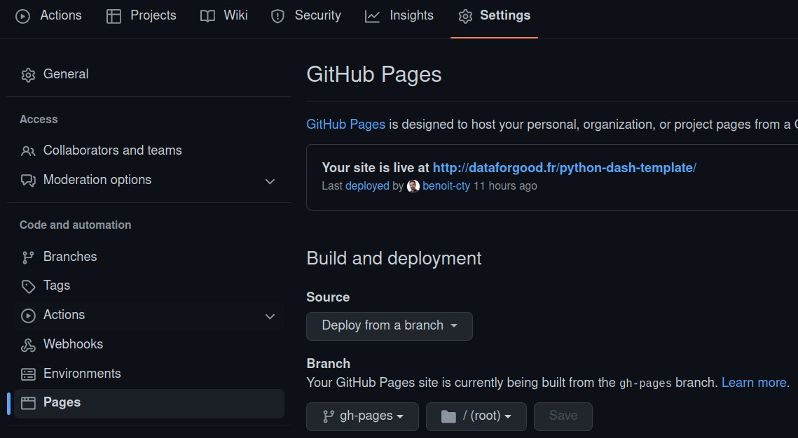

Template DataForGood
================

<!-- WARNING: THIS FILE WAS AUTOGENERATED! DO NOT EDIT! -->

This file will become your README and also the index of your
documentation.

# Contributing

## Utiliser Poetry

[Installer Poetry](https://python-poetry.org/docs/):

    curl -sSL https://install.python-poetry.org | python3 -

Installer les dépendances:

    poetry install

Ajouter une dépendance:

    poetry add pandas

Mettre à jour les dépendances:

    poetry update

## Connecter l’environnement à Jupyter

    poetry run python -m ipykernel install --name python-dash-template --user

## Publier la doc du projet

La générer en local

    poetry run nbdev_docs

Elle se trouvera dans le dossier `_docs`.

Elle est également générée et déployer automatiquement par GitHub
Action, dans la branche `gh-pages`, voici comment configurer Github.io:



La do est visible sur
[https://{userid}.github.io/{reponame}](https://dataforgoodfr.github.io/python-dash-template)

## Générer le module Python de votre code

    poetry run nbdev docs

## Tester avec Docker

    docker run .

## Install

``` sh
pip install {{lib_path}}
```

## How to use

Fill me in please! Don’t forget code examples:

``` python
1+1
```

    2
